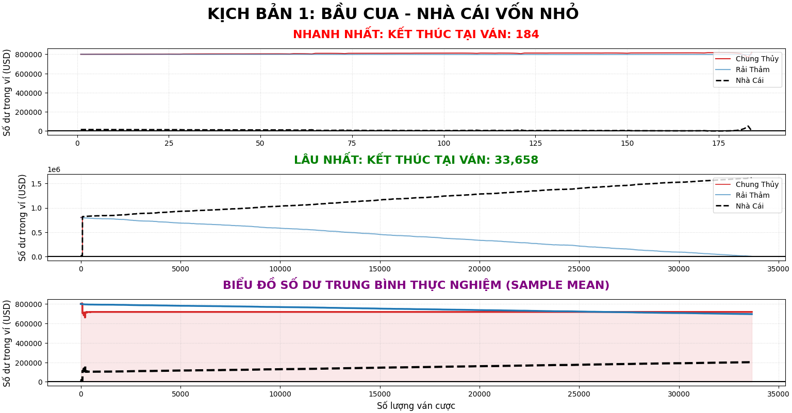
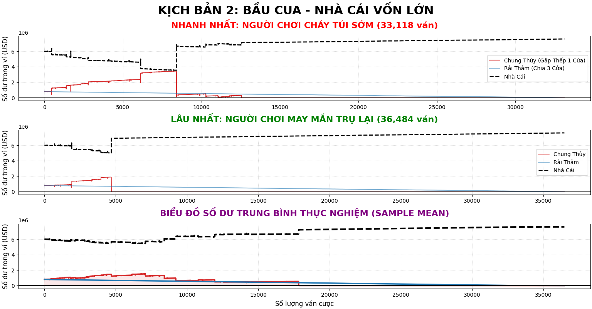

# 🎲 Monte Carlo Casino Simulation: The Mathematics of "Bầu Cua"


A high-performance financial risk simulation applying the Monte Carlo method to analyze the statistical variance and inevitability of **Gambler's Ruin**. This major update models the traditional Vietnamese 3-dice game **"Bầu Cua"** (similar to Crown and Anchor), pitting multiple betting portfolios against the casino's mathematical advantage.

---

## 🧮 The Mathematical Core: Proving the 7.87% House Edge

The centerpiece of this simulation is the absolute power of the **Expected Value (EV)**. Unlike a simple coin flip, Bầu Cua uses 3 independent dice with 6 faces. The payout structure creates a surprisingly high House Edge. 

If a player bets 1 unit on a single symbol (e.g., "Gourd"), the mathematical probability space is:

* **Lose (0 matches):** Probability $= (5/6)^3 = 125/216 \approx 57.87\%$. (Net: -1)
* **Win 1 Match:** Probability $= \binom{3}{1} \times (1/6) \times (5/6)^2 = 75/216 \approx 34.72\%$. (Net: +1)
* **Win 2 Matches:** Probability $= \binom{3}{2} \times (1/6)^2 \times (5/6) = 15/216 \approx 6.94\%$. (Net: +2)
* **Win 3 Matches:** Probability $= \binom{3}{3} \times (1/6)^3 \times (5/6)^0 = 1/216 \approx 0.46\%$. (Net: +3)

**Calculating the Expected Value (EV):**
$$EV = \left(-1 \times \frac{125}{216}\right) + \left(1 \times \frac{75}{216}\right) + \left(2 \times \frac{15}{216}\right) + \left(3 \times \frac{1}{216}\right)$$
$$EV = \frac{-125 + 75 + 30 + 3}{216} = \frac{-17}{216} \approx -0.0787$$

> **💡 Mathematical Conclusion:** The Casino holds a **7.87% House Edge**. This is nearly 3 times higher than European Roulette (2.7%). The simulation proves that in the long run, players lose ~7.87 units for every 100 units wagered, making long-term survival mathematically impossible.

---

## 🚀 System Architecture

* **Multi-threading Engine:** Maximizes CPU utilization by dynamically load-balancing 100+ million rounds across all available CPU threads (auto-detected via `std::thread::hardware_concurrency()`) using a **No-Mutex** architecture.
    * **Thread-Safe RNG:** Implements `thread_local std::mt19937` to provide each thread with its own independent Random Number Generator. This eliminates resource contention (lock contention) entirely, allowing parallel threads to operate at maximum CPU velocity.
* **OOP Design Patterns:**
    * **Strategy Pattern (`BettingStrategy.h`):** Dynamically injects betting logic. Evaluates two distinct strategies:
        1.  **Chung Thủy (Martingale):** Single-target betting with exponential bet sizing to chase losses.
        2.  **Rải Thảm (Spread Betting):** Dividing capital across 3 randomly chosen symbols to minimize short-term variance *(Note: This alters the bankroll trajectory but does not defeat the 7.87% House Edge)*.
    * **Factory Pattern (`PlayerFactory.h`):** Streamlines the initialization of player portfolios.
    * **Modern Memory Management (RAII):** Strictly adheres to modern C++ standards by utilizing Smart Pointers (`std::unique_ptr`) to manage the lifecycle of `Player`, `House`, and `BettingStrategy` objects. This guarantees zero memory leaks even when dynamically allocating and destroying objects across millions of simulated rounds.
    * **High-Performance I/O Buffering:** To conquer Disk I/O bottlenecks—the most common cause of slow simulations—the engine utilizes `std::ostringstream` as a RAM buffer. Instead of writing line-by-line, data is chunked and flushed to SSDs in batches of 10,000 rounds. This optimization exponentially accelerates execution speed by up to 20x.
* **Automated Data Pipeline:** C++17 handles the heavy probabilistic computation, instantly triggering a Python/Pandas script to parse the CSV outputs and render multi-dimensional charts (incorporating Forward-Fill algorithms to normalize early bankruptcies).
---

## 🧪 Simulation Scenarios & Result Analysis

The system splits the multi-threaded simulation into 2 parallel universes to observe the clash between **Short-term Variance** and the **Law of Large Numbers**:

### 1. Scenario: Small House Capital (`data_nho`)
Testing short-term risk thresholds where the house is vulnerable to high variance.
<p align="center">
  
</p>

* **The Volatility Threat:** When the casino's bankroll is small, the Law of Large Numbers hasn't taken effect. A player using an aggressive Martingale strategy can create massive financial shocks. As seen in the "Fastest" chart, the casino can be bankrupted in mere seconds if the player hits a lucky streak.

### 2. Scenario: Large House Capital (`data_lon`)
Observing the absolute power of Probability where house victory is a mathematical certainty.
<p align="center">
  
</p>

* **The Inevitability of Gambler's Ruin:** When the casino has sufficient capital to absorb all variance, the game shifts to a mathematical limit problem ($N \rightarrow \infty$). Even with a massive starting capital of 800,000 VNĐ, both the Spread and Martingale players are mathematically crushed by the 7.87% House Edge. The EV curve dictates a flawless, uninterrupted plunge to $0.

---

## ⚙️ Setup & Usage

### 1. Prerequisites
* Ensure you create an empty folder named `data/` in the project's root directory for the C++ engine to store output logs.
* A modern C++ compiler supporting **C++17** (for Structured Bindings and Filesystem APIs).

### 2. Python Environment Setup
This project uses Python for automated data visualization. Open your terminal and install the required libraries:
```bash
pip install pandas matplotlib numpy
```

### 3. Execution
* Open the `.sln` file using Visual Studio (2022 recommended).
* Press **F5** or click **Local Windows Debugger** to build and run.
* Wait a few seconds for the C++ engine to finish compiling and running; the Python charts will pop up automatically.

---
> **⚠️ Troubleshooting Note:** The C++ engine uses the `std::system("python ...")` command to trigger the charts. If the Python charts do not pop up automatically after the C++ execution finishes, ensure your system's environment variable is set to `python`. On macOS/Linux or newer Python installations, you may need to manually run the scripts in your terminal:
> ```bash
> python3 scripts/bao_cao_nhacai_nho.py
> python3 scripts/bao_cao_nhacai_lon.py
>```
> **Disclaimer:** This project is strictly for educational purposes and probability research. It does not encourage or promote gambling.

**Author:** [GROUP 4]